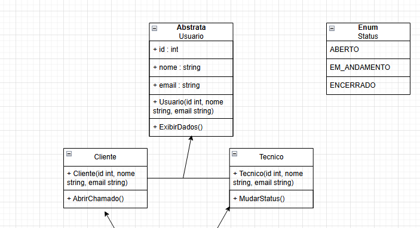
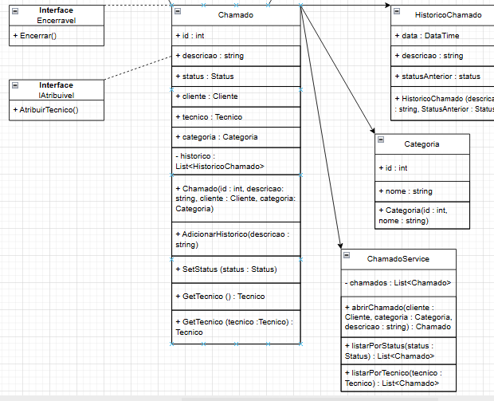

# sistema-de-suporte

O Sistema de suporte faz parte de uma atividade onde aplicamos os conhecimentos de POO, SOLID e Diagrama UML.

# Tecnologias Usadas

- C#
- Draw.io

# Diagrama

# Aplicação do SOLID

- S

A classe "ChamadoService" possui a função de Orquestrar operações de chamados.

- O

A classe abstrata "Usuario" permite novos tipos de usuário sem modificar código existente.

- L

A classe "Cliente" herda todos os atributos/métodos da classe "Usuario" e adiciona o método AbrirChamado()

- I

As interfaces que são implementadas, são bem específicas e diretas, são interfaces necessárias no código e precisam ser implementadas.

- D

A classe "Chamado" precisa implementar as interfaces para que sua funcionalidade seja execultada com sucesso.